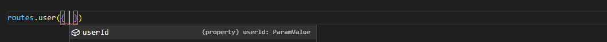
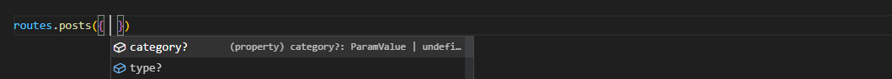

# <p align="center">Client Api Route</p>
### <p align="center">Helpers for working with API routes on the client</p>


## Table of contents

- [Install](#install)
- [Route](#route)
- - [param](#param)
- - [query](#query)
- - [group](#group)
- - [path](#path)


## Install
```bash
pnpm i @andremalveira/route
```

## Route

### param
Add dynamic parameters and query parameters in the path

>  - param: `path`
>  - return: `function(ParamValue | Object(ParamValue), Object?(QueryValue))` <br/> <br/>
> Recognized parameter key format: `:key` | `{key}` | `[key]`

```ts
// routes/api.routes.ts

import { param } from '@andremalveira/route';

const routes = {
    user: param('/user/:userId')
}

export default routes
```

```ts
// How to use

import routes from 'routes/api.routes';

const userId = 032;

routes.user(userId); // /user/032
```

#### Using typescript 

```ts
// Type
param<ParamKeys, QueryKeys>('/path') => (paramKeys, queryKeys) => string

//Example 
param<'userId'>('/user')
```


### query
Add query parameters in path

>  - param: `path`
>  - return: `function(Object?(QueryValue))` <br/> <br/>

```ts
// routes/api.routes.ts

import { query } from '@andremalveira/route';

const routes = {
    posts: query('/posts')
}

export default routes
```

```ts
// How to use

import routes from 'routes/api.routes';

routes.posts({ category: 'movies', type:'science-fiction' }); // /posts?category=movies&type=science-fiction
```

#### Using typescript 

```ts
// Type
query<QueryKeys>('/path') => (queryKeys?) => string

//Example 
query<'category' | 'type'>('/posts')
```


### group
Creates a group of routes based on the options

> - param_1: `Object(options)` | `{}` | null
> - -  `prefix?`: prefix for route path
> - -  `namespace?`: returns the routes inside a new object called 'namespace'
> - -  `baseUrl?`: url base from path

> - param_2: `Object(routes)`
> - return: `Object(routes)` <br/> <br/>

```ts
// routes/api.routes.ts

import { group } from '@andremalveira/route';

const routes = {
    post: group({ prefix: '/post' }, {
        add: '/add',
        update: param('/update/:postId'),
        delete: param('/delete/:postId'),
    })
}

export default routes
```

```ts
// How to use

import routes from 'routes/api.routes';

const postId = 12;

routes.post.add             //  /post/add
routes.post.update(postId)  //  /post/update/12
routes.post.delete(postId)  //  /post/delete/12
```

#### Type 

```ts
group({ 
    prefix?: string, 
    baseUrl?: string
    namespace?: string,
}, routes ) => routes
```

### path
Returns formatted path segment
> - param_1: `string[]`: url segment
> - param_2: `object`: query keys
> - return: `string` <br/> <br/>

```ts
import { path } from '@andremalveira/route';

const newPath = path(['api', 'user', 'posts'], { status: true }) // api/user/posts?status=true
```

#### Type 

```ts
path(string[], object) => string
```

## Licence 
[MIT](LICENSE)
